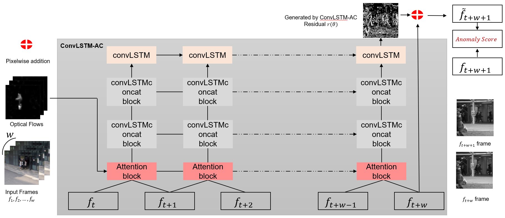

## Attention-guided residual frame learning for video anomaly detection
<p align="left"></p>

\* This code was developed in collaboration with Jun-Hyung Yu

This repository provides the official keras implementation of the following paper:
> **Abstract:**  *The problem of anomaly detection in video surveillance data has been an active research topic. 
The main difficulty of video anomaly detection is due to two different definitions of anomalies:  semantically abnormal objects and motion caused by unauthorized changes in objects.
We propose a new framework for  video anomaly detection by designing a convolutional long short-term memory-based model that emphasizes semantic objects using self-attention mechanisms and concatenation operations to further improve performance. Moreover, our proposed method is designed to learn only the residuals of the next frame, which allows the model to better focus on anomalous objects in video frames and also enhances stability of the training process. Our model substantially outperformed previous models on the Chinese University of Hong Kong (CUHK) Avenue and Subway Exit datasets. Our experiments also demonstrated that each module of the residual frame learning and the attention block incorporated into our framework is effective in improving the performance.* 

### Requirement
```shell
tensorflow == 1.9.0
keras == 2.2.4
```

### Train
```shell
bash ./src/train.sh
```

### Evaluate
```shell
evaluate.ipynb
```

### Citation
```
@article{yu2023attention,
  title={Attention-guided residual frame learning for video anomaly detection},
  author={Yu, Jun-Hyung and Moon, Jeong-Hyeon and Sohn, Kyung-Ah},
  journal={Multimedia Tools and Applications},
  volume={82},
  number={8},
  pages={12099--12116},
  year={2023},
  publisher={Springer}
}
```